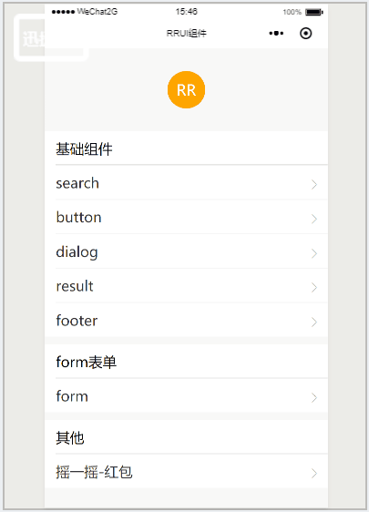
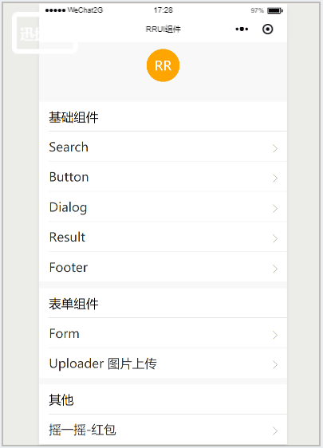

## 目录结构

```
|——component 组件  
|    |——button  
|    |——dialog  
|    |——footer  
|    |——result  
|    |——search  
|——pages   
|    |——index     首页  
|    |——button    按钮  
|    |——dialog    弹框  
|    |——footer    页脚   
|    |——red-paper 红包  
|    |——result    结果页  
|    |——search    搜索页  
|    |——form      form表单  
|    |——uploader  图片上传 
|——utils  
```


